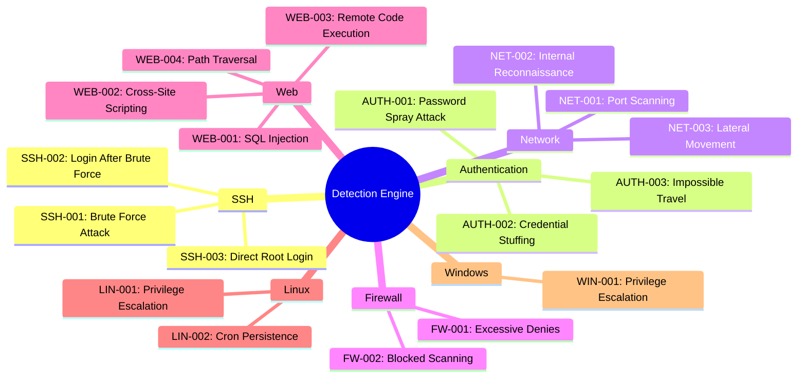
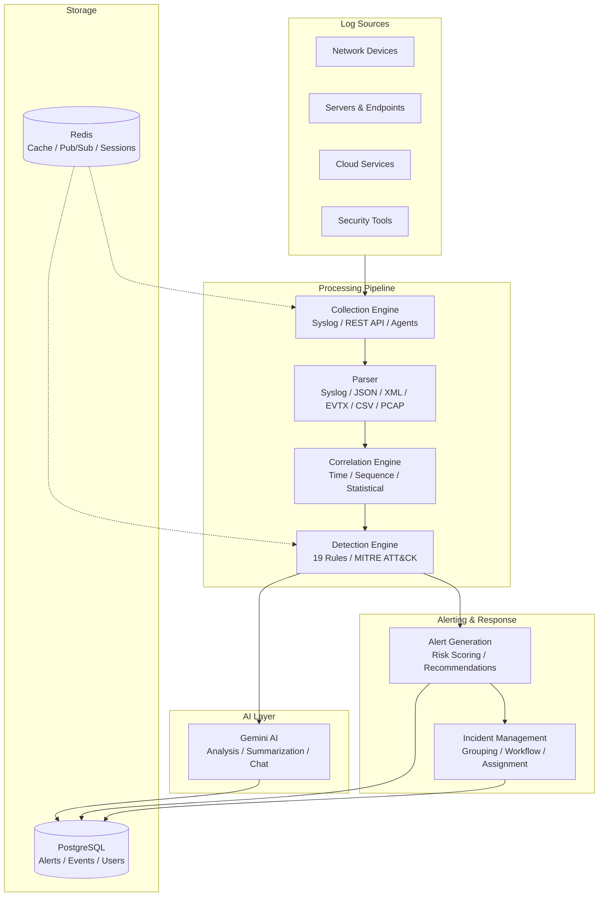

<div align="center">
  <br/>
  <br/>
  <h1>SentinelAI</h1>
  <h3>Enterprise AI-Powered Security Operations Center (SOC) & SIEM Platform</h3>
  <br/>
  <p><strong>A comprehensive, modular security platform for real-time threat detection, event correlation, and incident response — powered by artificial intelligence.</strong></p>
  <br/>

  [](https://python.org)
  [](https://fastapi.tiangolo.com)
  [](https://react.dev)
  [](https://typescriptlang.org)
  [](https://postgresql.org)
  [](https://docker.com)
  [](https://redis.io)
  [](https://ai.google.dev)
  <br/>
  [](https://opensource.org/licenses/MIT)
  [](https://github.com/Shravani-kurkute/SOC-Analayzer/stargazers)
  [](https://github.com/Shravani-kurkute/SOC-Analayzer/pulls)

  <br/>
  <br/>
</div>

---

## Overview

SentinelAI is an enterprise-grade Security Operations Center (SOC) platform that provides real-time threat detection, log analysis, event correlation, and incident response capabilities. Built with a modern tech stack and powered by Google Gemini AI, it serves as a comprehensive SIEM solution for security teams.

The platform processes security events through a multi-stage pipeline — ingestion, parsing, correlation, and detection — generating actionable alerts with MITRE ATT&CK mapping, risk scoring, and remediation recommendations.

---

## Features

### Core Capabilities

| Feature | Status | Description |
|---------|--------|-------------|
| **Authentication & RBAC** | Complete | JWT-based auth with role-based access control (Admin, Analyst, Responder, Viewer), MFA support, and token rotation |
| **Dashboard & Analytics** | Complete | Real-time SOC dashboard with severity distributions, attack timelines, MITRE tactic breakdown, geographic threat mapping, and top source IP tracking |
| **Log Upload & Parsing** | Complete | Multi-format log parser supporting Syslog, JSON, XML, EVTX, CSV, and PCAP with ECS normalization and GeoIP enrichment |
| **Event Correlation** | Complete | Time-based, sequence-based, and statistical correlation engine detecting attack chains, SSH sessions, port scans, credential attacks, and web threats |
| **Threat Detection** | Complete | 19 modular detection rules across 7 categories with MITRE ATT&CK mapping, risk scoring, and automated alert generation |
| **Incident Management** | In Progress | Alert grouping, status workflows, analyst assignment, investigation notes, and timeline tracking |
| **AI Investigation** | Planned | Gemini-powered log analysis, natural language threat hunting, automated incident summarization, and chat-based security assistant |
| **Playbook Automation** | Planned | Visual playbook editor with conditional branching and automated response actions |
| **Threat Intelligence** | Planned | STIX/TAXII feed integration, IOC extraction and enrichment, and automated threat matching |
| **Advanced Reporting** | Planned | Executive summaries, compliance reports (SOC 2, PCI DSS, HIPAA), and scheduled report generation |

### Detection Categories



---

## Architecture



---

## Technology Stack

### Frontend

| Technology | Purpose |
|-----------|---------|
| [React 18](https://react.dev) + [TypeScript](https://typescriptlang.org) | Component-based SPA architecture |
| [Tailwind CSS 3](https://tailwindcss.com) | Utility-first responsive design |
| [Shadcn UI](https://ui.shadcn.com) + [Radix Primitives](https://radix-ui.com) | Accessible, themeable component library |
| [React Query](https://tanstack.com/query) | Server state management, caching, background refetching |
| [Zustand](https://zustand-demo.pmnd.rs) | Lightweight client-side state management |
| [Framer Motion](https://framer.com/motion) | UI animations and threat indicators |
| [Recharts](https://recharts.org) | Dashboard analytics visualizations |
| [React Router v6](https://reactrouter.com) | Client-side routing with guards |

### Backend

| Technology | Purpose |
|-----------|---------|
| [FastAPI 0.115](https://fastapi.tiangolo.com) | Async Python web framework |
| [SQLAlchemy 2.0](https://sqlalchemy.org) | Async ORM with PostgreSQL |
| [Pydantic v2](https://docs.pydantic.dev) | Request/response schema validation |
| [PostgreSQL 17](https://postgresql.org) | ACID-compliant primary database |
| [Redis 7](https://redis.io) | Caching, session store, Pub/Sub |
| [Alembic](https://alembic.sqlalchemy.org) | Database migration management |
| [Google Gemini](https://ai.google.dev) | AI-powered threat analysis |
| [Celery](https://docs.celeryq.dev) | Async task queue |
| [Structlog](https://structlog.org) | Structured JSON logging |

### Infrastructure

| Technology | Purpose |
|-----------|---------|
| [Docker](https://docker.com) + [Compose](https://docs.docker.com/compose) | Containerized deployment |
| [Nginx](https://nginx.com) | Reverse proxy, TLS termination, static file serving |
| [GitHub Actions](https://github.com/features/actions) | CI/CD pipeline |
| [Prometheus](https://prometheus.io) | Metrics collection |
| [Sentry](https://sentry.io) | Error tracking |

---

## Getting Started

### Prerequisites

- [Docker](https://docker.com) 24+ and [Docker Compose](https://docs.docker.com/compose)
- [Node.js](https://nodejs.org) 22+ (for manual setup)
- [Python](https://python.org) 3.12+ (for manual setup)

### Quick Start (Docker)

```bash
# Clone the repository
git clone https://github.com/Shravani-kurkute/SOC-Analayzer.git
cd SOC-Analayzer

# Configure environment
cp sentinelai-backend/.env.example sentinelai-backend/.env
cp sentinelai-frontend/.env.example sentinelai-frontend/.env

# Start all services
docker compose up -d

# Run database migrations
docker compose exec backend alembic upgrade head

# Seed initial data
docker compose exec backend python scripts/seed.py

# Access the platform
# Frontend: http://localhost:3000
# API Docs: http://localhost:8000/api/v1/docs
```

### Manual Setup

**Backend:**

```bash
cd sentinelai-backend
python -m venv venv && source venv/bin/activate
pip install -r requirements.txt
cp .env.example .env
alembic upgrade head
uvicorn app.main:app --reload --host 0.0.0.0 --port 8000
```

**Frontend:**

```bash
cd sentinelai-frontend
npm install
cp .env.example .env
npm run dev
```

See [docs/SETUP.md](docs/SETUP.md) for detailed installation instructions.

---

## Project Structure

```
sentinelai/
├── sentinelai-backend/          # FastAPI backend
│   ├── app/
│   │   ├── api/v1/             # API route definitions
│   │   ├── core/               # Configuration, dependencies, security
│   │   ├── models/             # SQLAlchemy ORM models
│   │   ├── schemas/            # Pydantic validation schemas
│   │   ├── routers/            # API endpoint implementations
│   │   ├── services/           # Business logic layer
│   │   ├── detection/          # Detection engine & modules
│   │   ├── parsers/            # Log parsing engines
│   │   ├── middleware/         # ASGI middleware components
│   │   └── ai/                 # Gemini AI integration
│   ├── alembic/                # Database migrations
│   └── tests/                  # Test suite
├── sentinelai-frontend/        # React SPA
│   ├── src/
│   │   ├── components/         # Reusable UI components
│   │   ├── pages/              # Route-level page components
│   │   ├── hooks/              # Custom React hooks
│   │   ├── services/           # API client layer
│   │   ├── store/              # Zustand state stores
│   │   ├── types/              # TypeScript type definitions
│   │   ├── contexts/           # React context providers
│   │   └── utils/              # Utility functions
│   └── ...
├── infra/                      # Infrastructure configuration
├── docs/                       # Project documentation
├── docker-compose.yml          # Docker composition
└── README.md
```

---

## API Overview

| Method | Endpoint | Description |
|--------|----------|-------------|
| **Authentication** | | |
| `POST` | `/auth/login` | User login |
| `POST` | `/auth/refresh` | Refresh access token |
| `POST` | `/auth/mfa/verify` | Verify MFA code |
| **Alerts** | | |
| `GET` | `/alerts` | List alerts (paginated, filtered) |
| `GET` | `/alerts/{id}` | Get alert detail |
| `PATCH` | `/alerts/{id}` | Update alert status |
| `GET` | `/alerts/stats` | Alert statistics |
| **Detection** | | |
| `POST` | `/detection/run` | Run detection rules |
| `POST` | `/detection/run-all` | Run all detection rules |
| `GET` | `/detection/rules` | List detection rules |
| `GET` | `/detection/status` | Engine status |
| **Correlation** | | |
| `POST` | `/correlation/run` | Run correlation |
| `POST` | `/correlation/run-all` | Run all correlation rules |
| `GET` | `/correlation` | List correlation groups |
| **Dashboard** | | |
| `GET` | `/dashboard/summary` | Dashboard summary metrics |
| `GET` | `/dashboard/charts` | Dashboard chart data |
| `GET` | `/dashboard/recent-alerts` | Recent alerts |
| **Incidents** | | |
| `GET` | `/incidents` | List incidents |
| `POST` | `/incidents` | Create incident |
| `PATCH` | `/incidents/{id}` | Update incident |

See [docs/API.md](docs/API.md) for the complete API reference.

---

## Documentation

| Document | Description |
|----------|-------------|
| [Architecture](docs/ARCHITECTURE.md) | System architecture, data flow, and design decisions |
| [API Reference](docs/API.md) | Complete API endpoint documentation |
| [Database Schema](docs/DATABASE.md) | ER diagrams, table schemas, and index strategy |
| [Setup Guide](docs/SETUP.md) | Installation, configuration, and troubleshooting |
| [Security Model](docs/SECURITY.md) | Authentication, RBAC, and security controls |
| [Detection Rules](docs/RULES.md) | Complete detection rule catalog |
| [Roadmap](docs/ROADMAP.md) | Current status and planned features |

---

## Project Status

### Completed Modules

- [x] **Authentication & RBAC** — JWT auth, role-based access, MFA, token rotation
- [x] **Dashboard & Analytics** — Real-time SOC dashboard with dynamic charts
- [x] **Log Upload & Parsing** — Multi-format support with ECS normalization
- [x] **Event Correlation** — Attack chain and pattern detection engine
- [x] **Threat Detection** — 19 rules across 7 categories with MITRE mapping

### In Progress

- [ ] **Incident Management** — Alert grouping, workflows, assignment
- [ ] **MITRE ATT&CK Integration** — Full matrix integration and coverage analysis

### Planned

- [ ] **AI Security Assistant** — Gemini-powered analysis and chat
- [ ] **IOC Extraction Pipeline** — Automated indicator extraction and enrichment
- [ ] **Playbook Automation** — Visual playbook editor and execution
- [ ] **Threat Intelligence Feeds** — STIX/TAXII integration
- [ ] **Advanced Reporting** — Compliance and executive reports
- [ ] **Multi-Tenancy** — Organization isolation for MSSP deployments
- [ ] **Kubernetes Support** — Helm charts and auto-scaling

---

## Screenshots

Screenshots are stored in `docs/images/`. Add screenshots by placing them in that directory and referencing them as:

```markdown


```

---

## Contributing

Contributions are welcome and appreciated. Please follow these guidelines:

1. **Fork** the repository
2. **Create** a feature branch: `git checkout -b feature/your-feature`
3. **Commit** your changes: `git commit -m "feat(scope): description"`
4. **Push** to the branch: `git push origin feature/your-feature`
5. **Submit** a pull request

### Commit Convention

We follow [Conventional Commits](https://www.conventionalcommits.org/):

- `feat(module): description` — New feature
- `fix(module): description` — Bug fix
- `docs(module): description` — Documentation
- `refactor(module): description` — Code restructuring
- `test(module): description` — Test addition/fix
- `perf(module): description` — Performance improvement

### Development Guidelines

- TypeScript strict mode enabled — no `any` without justification
- Python type hints required on all functions
- Test coverage should be maintained or improved
- Follow existing code style and patterns
- Document public APIs and complex logic

---

## License

Distributed under the MIT License. See `LICENSE` for more information.

---

## Author

**Shravani Kurkute**

- GitHub: [@Shravani-kurkute](https://github.com/Shravani-kurkute)

---

<div align="center">
  <br/>
  <sub>Built with dedication for the security community.</sub>
  <br/>
  <br/>
</div>
