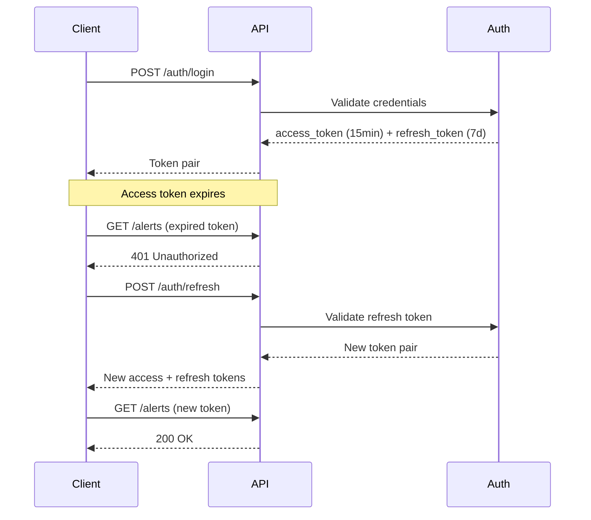
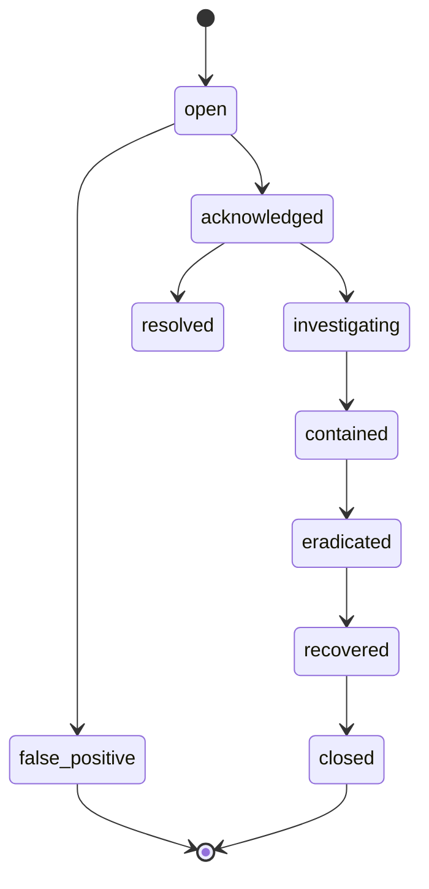

# SentinelAI API Reference

> **Base URL:** `/api/v1`  
> **Protocol:** HTTPS (production), HTTP (development)  
> **Content Type:** `application/json`  
> **Version:** 1.0.0

---

## Table of Contents

1. [Authentication](#1-authentication)
2. [Alerts](#2-alerts)
3. [Detection](#3-detection)
4. [Incidents](#4-incidents)
5. [Correlation](#5-correlation)
6. [Dashboard](#6-dashboard)
7. [Assets](#7-assets)
8. [Admin](#8-admin)
9. [Webhooks](#9-webhooks)
10. [Error Codes](#10-error-codes)

---

## 1. Authentication

All API requests (except `/auth/*` and `/health`) require authentication via JWT Bearer token or API Key.

### Headers

```
Authorization: Bearer <access_token>
X-API-Key: <api_key>
X-Request-ID: <uuid>        # Optional, for tracing
```

### 1.1 Login

```http
POST /auth/login
Content-Type: application/json

{
  "email": "analyst@soc.company.com",
  "password": "secure_password"
}
```

**Response 200:**

```json
{
  "access_token": "eyJhbGciOiJIUzI1NiIs...",
  "refresh_token": "dGhpcyBpcyBhIHJlZnJl...",
  "token_type": "bearer",
  "expires_in": 900,
  "user": {
    "id": "uuid",
    "email": "analyst@soc.company.com",
    "full_name": "Jane Analyst",
    "role": "analyst"
  }
}
```

### 1.2 Token Refresh

```http
POST /auth/refresh
Content-Type: application/json

{
  "refresh_token": "dGhpcyBpcyBhIHJlZnJl..."
}
```

### 1.3 Token Lifecycle



---

## 2. Alerts

### 2.1 List Alerts

```http
GET /alerts?severity=critical&status=open&page=1&page_size=20&sort_by=created_at&sort_order=desc
```

**Query Parameters:**

| Parameter | Type | Default | Description |
|-----------|------|---------|-------------|
| `severity` | string | - | Filter: `critical`, `high`, `medium`, `low` |
| `status` | string | - | Filter: `open`, `acknowledged`, `investigating`, `resolved`, `false_positive` |
| `rule_id` | string | - | Filter by detection rule |
| `source_ip` | string | - | Filter by source IP |
| `mitre_tactic` | string | - | Filter by MITRE tactic |
| `search` | string | - | Full-text search on title, description, IP |
| `sort_by` | string | `created_at` | Sort field |
| `sort_order` | string | `desc` | `asc` or `desc` |
| `page` | integer | `1` | Page number |
| `page_size` | integer | `20` | Items per page (max 100) |

**Response 200:**

```json
{
  "items": [
    {
      "id": "uuid",
      "title": "SSH Brute Force from 10.0.0.5",
      "description": "Detected 23 failed SSH login attempts...",
      "severity": "high",
      "status": "open",
      "source_ip": "10.0.0.5",
      "mitre_technique_id": "T1110",
      "mitre_tactic": "credential_access",
      "rule_id": "SSH-001",
      "rule_name": "SSH Brute Force Attack",
      "score": 85,
      "tags": ["ssh", "brute-force"],
      "country": "Unknown",
      "recommendation": "Block the source IP at the firewall...",
      "created_at": "2026-07-28T10:30:00Z",
      "updated_at": "2026-07-28T10:30:00Z"
    }
  ],
  "total": 142,
  "page": 1,
  "page_size": 20,
  "total_pages": 8
}
```

### 2.2 Get Alert Detail

```http
GET /alerts/{alert_id}
```

### 2.3 Update Alert Status

```http
PATCH /alerts/{alert_id}
Content-Type: application/json

{
  "status": "acknowledged"
}
```

**Status Transitions:**



### 2.4 Delete Alert

```http
DELETE /alerts/{alert_id}
```

### 2.5 Alert Statistics

```http
GET /alerts/stats
```

**Response 200:**

```json
{
  "total": 1042,
  "by_severity": { "critical": 45, "high": 189, "medium": 523, "low": 285 },
  "by_status": { "open": 312, "acknowledged": 89, "resolved": 641 },
  "by_rule": { "SSH-001": 234, "NET-001": 156, "FW-001": 89 },
  "top_source_ips": [
    { "ip": "10.0.0.5", "count": 234 },
    { "ip": "192.168.1.100", "count": 156 }
  ],
  "avg_score": 42.5,
  "recent_trend": [
    { "date": "2026-07-27", "count": 142 },
    { "date": "2026-07-26", "count": 98 }
  ]
}
```

---

## 3. Detection

### 3.1 Run Detection

```http
POST /detection/run
Content-Type: application/json

{
  "event_ids": ["uuid1", "uuid2"],
  "rule_ids": ["SSH-001", "AUTH-001"]
}
```

**Response 200:**

```json
{
  "alerts_created": 3,
  "alerts": [
    { "id": "uuid", "title": "SSH Brute Force...", "severity": "high", "score": 85 }
  ]
}
```

### 3.2 Run All Detection Rules

```http
POST /detection/run-all
```

### 3.3 List Detection Rules

```http
GET /detection/rules?category=ssh
```

### 3.4 Detection Engine Status

```http
GET /detection/status
```

**Response 200:**

```json
{
  "engine_version": "1.0.0",
  "total_rules": 19,
  "enabled_rules": 19,
  "modules_loaded": ["ssh", "authentication", "network", "firewall", "web", "linux", "windows"]
}
```

---

## 4. Incidents

### 4.1 List Incidents

```http
GET /incidents?status=open&severity=critical&page=1&page_size=20
```

### 4.2 Create Incident

```http
POST /incidents
Content-Type: application/json

{
  "title": "Targeted Credential Attack on Finance VPN",
  "description": "Multiple credential stuffing attempts...",
  "severity": "critical",
  "category": "credential_attack",
  "alert_ids": ["uuid1", "uuid2", "uuid3"]
}
```

### 4.3 Update Incident

```http
PATCH /incidents/{incident_id}
Content-Type: application/json

{
  "status": "investigating",
  "assignee_id": "user_uuid"
}
```

---

## 5. Correlation

### 5.1 Run Correlation

```http
POST /correlation/run?rule_name=ssh_brute_force
```

### 5.2 Run All Rules

```http
POST /correlation/run-all
```

### 5.3 List Correlation Groups

```http
GET /correlation?group_type=ssh_session&status=open&limit=50&offset=0
```

---

## 6. Dashboard

### 6.1 Summary

```http
GET /dashboard/summary
```

**Response 200:**

```json
{
  "total_logs_processed": 1048576,
  "active_incidents": 12,
  "critical_alerts": 45,
  "high_alerts": 189,
  "medium_alerts": 523,
  "low_alerts": 285,
  "threat_score": 72.4,
  "assets_monitored": 156
}
```

### 6.2 Charts

```http
GET /dashboard/charts
```

Returns attack timeline, severity distribution, MITRE tactic breakdown, geographic distribution, and top source IPs.

### 6.3 Recent Activity

```http
GET /dashboard/recent-alerts?limit=10
GET /dashboard/recent-incidents?limit=10
GET /dashboard/recent-logs?limit=10
```

---

## 7. Assets

### 7.1 List Assets

```http
GET /assets?asset_type=server&status=online
```

### 7.2 Asset Details

```http
GET /assets/{asset_id}
PATCH /assets/{asset_id}
```

---

## 8. Admin

### 8.1 User Management

```http
GET /admin/users
POST /admin/users
PATCH /admin/users/{user_id}
DELETE /admin/users/{user_id}
```

### 8.2 Audit Logs

```http
GET /admin/audit-logs?limit=50&offset=0
```

### 8.3 System Health

```http
GET /admin/system-health
```

---

## 9. Webhooks

### 9.1 SIEM Event Ingestion

```http
POST /webhooks/siem
Content-Type: application/json

{
  "timestamp": "2026-07-28T10:30:00Z",
  "source": "firewall",
  "action": "deny",
  "src_ip": "10.0.0.5",
  "dest_ip": "203.0.113.50",
  "protocol": "TCP",
  "dest_port": 443
}
```

---

## 10. Error Codes

| HTTP Status | Error Code | Description |
|-------------|------------|-------------|
| 400 | `VALIDATION_ERROR` | Invalid request body or parameters |
| 401 | `UNAUTHORIZED` | Missing or invalid authentication |
| 403 | `FORBIDDEN` | Insufficient permissions |
| 404 | `NOT_FOUND` | Resource does not exist |
| 409 | `CONFLICT` | Resource already exists |
| 422 | `UNPROCESSABLE_ENTITY` | Schema validation failure |
| 429 | `RATE_LIMIT_EXCEEDED` | Too many requests |
| 500 | `INTERNAL_ERROR` | Unhandled server error |
| 503 | `SERVICE_UNAVAILABLE` | Dependency failure |

### Error Response Format

```json
{
  "success": false,
  "errorCode": "VALIDATION_ERROR",
  "message": "Invalid input data",
  "details": {
    "field": "email",
    "reason": "Invalid email format"
  },
  "requestId": "req-uuid-here"
}
```
