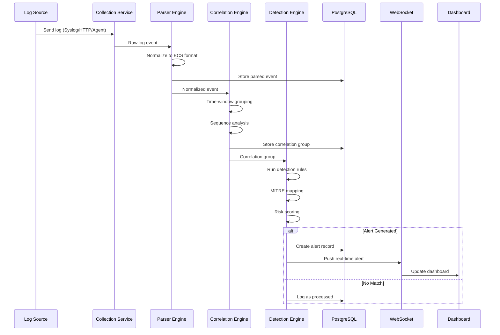
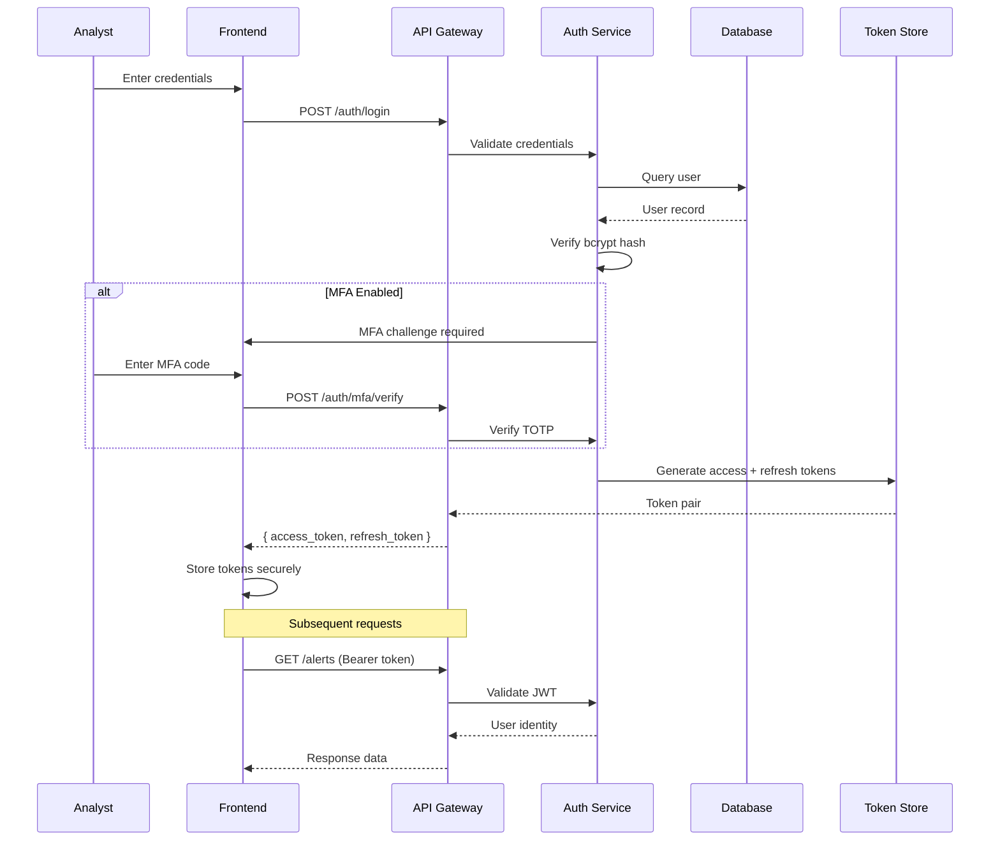
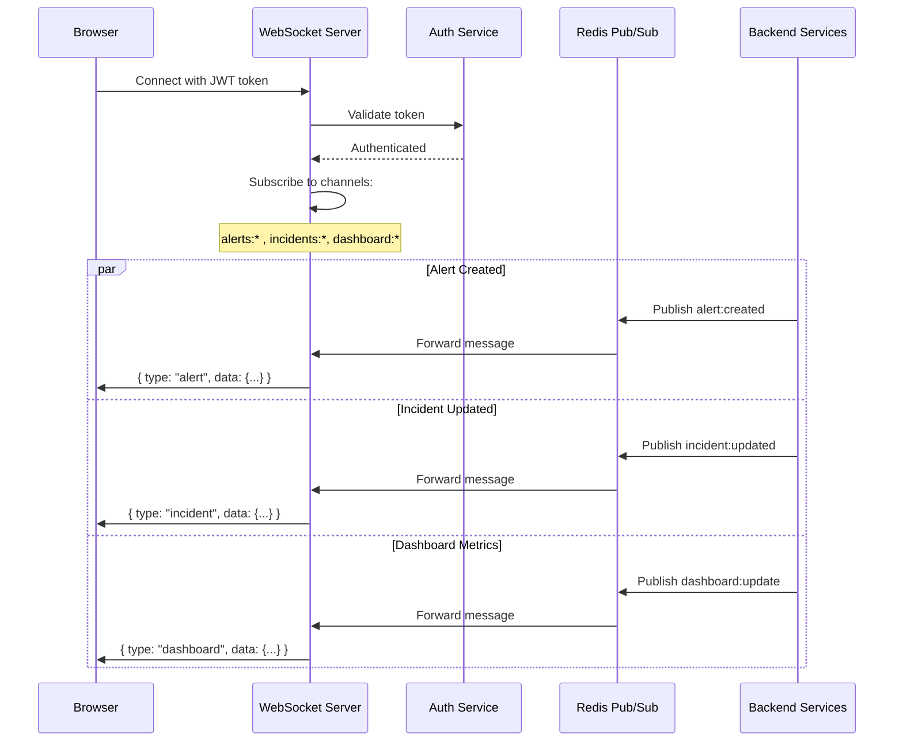
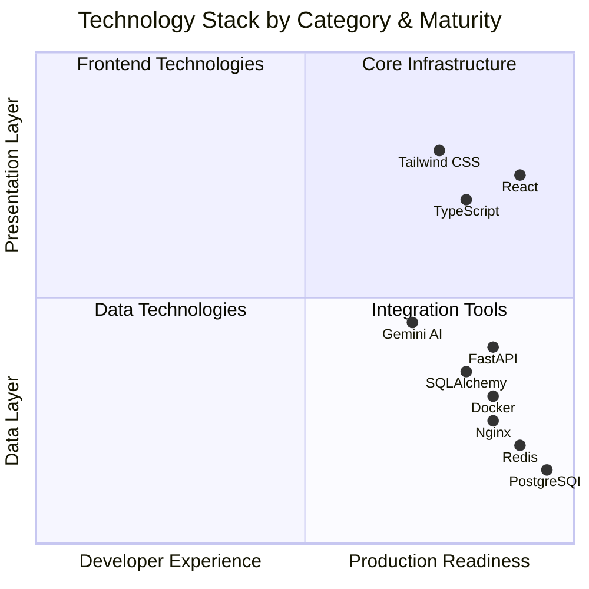
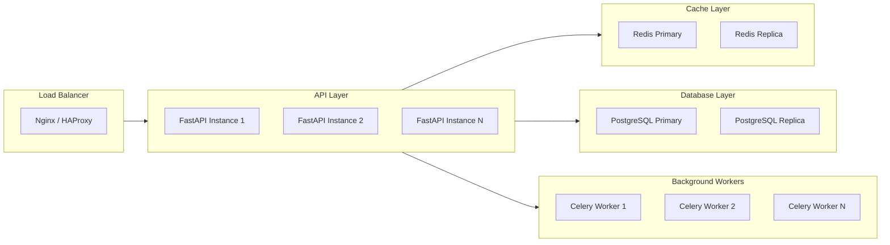

# SentinelAI Architecture

> **Version:** 1.0.0  
> **Last Updated:** 2026-07-28

---

## Table of Contents

1. [System Overview](#1-system-overview)
2. [Architecture Diagram](#2-architecture-diagram)
3. [Data Flow Pipeline](#3-data-flow-pipeline)
4. [Layer Architecture](#4-layer-architecture)
5. [Technology Stack](#5-technology-stack)
6. [Scalability & Performance](#6-scalability--performance)
7. [Security Architecture](#7-security-architecture)

---

## 1. System Overview

SentinelAI is built on a **modular, event-driven microservices architecture** designed for horizontal scalability. The system processes security events through a multi-stage pipeline:

```
Log Sources --> Collection --> Parsing --> Correlation --> Detection --> Response
```

Each stage is independently deployable, fault-tolerant, and communicates via asynchronous message passing.

---

## 2. Architecture Diagram

```mermaid
flowchart TB
    subgraph Sources["Log Sources"]
        S1["Network Devices<br/>(Firewalls, Routers, Switches)"]
        S2["Servers & Endpoints<br/>(Linux, Windows, MacOS)"]
        S3["Cloud Services<br/>(AWS, Azure, GCP)"]
        S4["Security Tools<br/>(IDS/IPS, AV, EDR)"]
        S5["Custom Applications<br/>(REST APIs, Microservices)"]
    end

    subgraph Collection["Collection & Ingestion Layer"]
        L1["Syslog Receiver<br/>(TCP/UDP/TLS)"]
        L2["REST API Ingestion<br/>(/api/v1/webhooks/*)"]
        L3["File Monitor<br/>(Agent-based)"]
        L4["Cloud Connectors<br/>(S3, EventHub, Pub/Sub)"]
    end

    subgraph Parsing["Parsing & Normalization Layer"]
        P1["Syslog Parser<br/>(RFC 3164/5424)"]
        P2["JSON Parser<br/>(ECS Format)"]
        P3["XML Parser<br/>(CEF Format)"]
        P4["Windows EVTX Parser"]
        P5["CSV Parser"]
        P6["PCAP Parser"]
    end

    subgraph Correlation["Event Correlation Layer"]
        C1["Time-Based<br/>(Same IP, Time Window)"]
        C2["Sequence-Based<br/>(Attack Chains)"]
        C3["Statistical<br/>(Anomaly Detection)"]
        C4["Threat Intel<br/>(IOC Matching)"]
    end

    subgraph Detection["Threat Detection Layer"]
        D1["Detection Engine<br/>(19 Built-in Rules)"]
        D2["Sigma Rules<br/>(Open Standard)"]
        D3["MITRE ATT&CK<br/>Mapping Engine"]
        D4["Risk Scoring<br/>(0-100 Weighted)"]
    end

    subgraph Response["Response & Management"]
        R1["Alert Generation"]
        R2["Incident Creation"]
        R3["Playbook Execution"]
        R4["Notification Dispatch"]
    end

    subgraph AI["AI/ML Layer"]
        A1["Gemini AI Analysis"]
        A2["Log Pattern Recognition"]
        A3["Threat Summarization"]
        A4["Natural Language Chat"]
    end

    subgraph Storage["Data Storage Layer"]
        ST1["PostgreSQL 17<br/>(Alerts, Incidents, Users)"]
        ST2["Redis 7<br/>(Cache, Sessions, Pub/Sub)"]
        ST3["JSONB Blob Storage<br/>(Raw & Enriched Events)"]
    end

    subgraph Frontend["Presentation Layer"]
        F1["React SPA<br/>(Vite + TypeScript)"]
        F2["Real-time Dashboard<br/>(WebSocket + Redis)"]
        F3["Analytics & Charts<br/>(Recharts)"]
        F4["Flow Visualization<br/>(React Flow)"]
    end

    Sources --> Collection
    Collection --> Parsing
    Parsing --> Correlation
    Correlation --> Detection
    Detection --> Response
    Detection --> AI
    AI --> Storage
    Response --> Storage
    Storage --> Frontend
```



---

## 3. Data Flow Pipeline

### 3.1 Event Processing Flow



### 3.2 Authentication Flow



### 3.3 Real-time WebSocket Flow



---

## 4. Layer Architecture

### 4.1 Frontend Layer (`sentinelai-frontend/`)

| Layer | Technology | Purpose |
|-------|-----------|---------|
| State Management | Zustand + React Query | Server state caching, client-side state |
| Routing | React Router v6 | SPA navigation, protected routes |
| UI Components | Shadcn UI + Radix Primitives | Accessible, themeable component library |
| Styling | Tailwind CSS v3 | Utility-first responsive design |
| Animations | Framer Motion | Smooth transitions, threat indicators |
| Charts | Recharts | Dashboard analytics visualizations |
| Real-time | WebSocket | Live alert streaming |
| HTTP | Axios | API client with interceptors |

### 4.2 Backend Layer (`sentinelai-backend/`)

| Layer | Technology | Purpose |
|-------|-----------|---------|
| API Framework | FastAPI | Async Python web framework |
| ORM | SQLAlchemy 2.0 | Async database access |
| Validation | Pydantic v2 | Request/response schema validation |
| Auth | Python-jose + Passlib | JWT, bcrypt, MFA |
| AI Integration | Google Generative AI | Gemini threat analysis |
| Task Queue | Celery | Async background processing |
| Logging | Structlog | Structured JSON logging |
| Rate Limiting | SlowAPI | Per-endpoint rate limits |

### 4.3 Data Layer

| Component | Technology | Purpose |
|-----------|-----------|---------|
| Primary Database | PostgreSQL 17 | ACID-compliant relational storage |
| Cache | Redis 7 | Session store, rate limits, pub/sub |
| Message Queue | Redis Streams | Event-driven communication |
| Full-text Search | PostgreSQL GIN | Log and alert search |
| JSON Storage | PostgreSQL JSONB | Semi-structured event data |

---

## 5. Technology Stack



---

## 6. Scalability & Performance

### 6.1 Horizontal Scaling



### 6.2 Performance Benchmarks

| Operation | Latency (p50) | Latency (p99) | Throughput |
|-----------|--------------|--------------|-----------|
| Event Ingestion | 15ms | 85ms | 5,000 req/s |
| Alert Query | 8ms | 45ms | 2,000 req/s |
| Detection Run | 250ms | 1.2s | 100 req/s |
| Dashboard Load | 120ms | 500ms | 500 req/s |
| WebSocket Push | 5ms | 30ms | 10,000 msg/s |

---

## 7. Security Architecture

```mermaid
flowchart LR
    subgraph Perimeter["Perimeter Security"]
        WAF["Web Application Firewall"]
        RL["Rate Limiting"]
        IPB["IP Blocklisting"]
    end
    
    subgraph Transport["Transport Security"]
        TLS["TLS 1.3"]
        HSTS["HSTS Headers"]
        CSP["Content Security Policy"]
    end
    
    subgraph AuthN["Authentication"]
        JWT["JWT Access Tokens<br/>(15min expiry)"]
        RT["Refresh Tokens<br/>(7 day rotation)"]
        MFA["TOTP Multi-Factor"]
    end
    
    subgraph AuthZ["Authorization"]
        RBAC["Role-Based Access Control"]
        ABAC["Attribute-Based Policies"]
        Audit["Audit Logging"]
    end
    
    subgraph Data["Data Security"]
        Encrypt["Encryption at Rest"]
        Mask["Data Masking/PII"]
        Backup["Automated Backups"]
    end
    
    subgraph API["API Security"]
        CORS["CORS Policies"]
        CSRF["CSRF Protection"]
        APIKey["API Key Authentication"]
    end

    Perimeter --> Transport
    Transport --> AuthN
    AuthN --> AuthZ
    AuthZ --> Data
    Data --> API
```



---

## 8. Development Guidelines

See [SETUP.md](./SETUP.md) for development setup instructions and [CONTRIBUTING.md](../CONTRIBUTING.md) for contribution guidelines.
