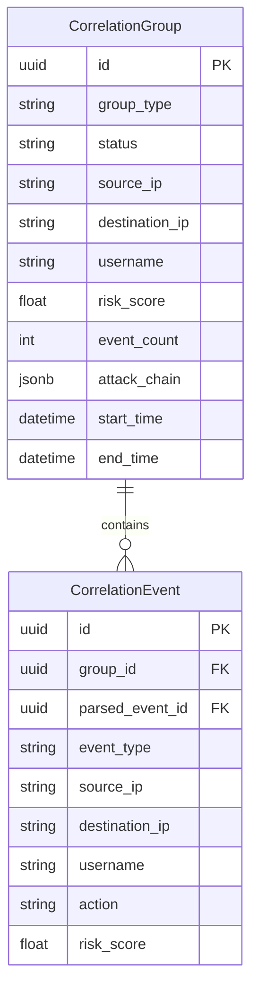

# SentinelAI Database Schema

> **Version:** 1.0.0  
> **Engine:** PostgreSQL 17  
> **Last Updated:** 2026-07-28

---

## Table of Contents

1. [Entity Relationship Diagram](#1-entity-relationship-diagram)
2. [Core Tables](#2-core-tables)
3. [Security Logs](#3-security-logs)
4. [Detection & Correlation](#4-detection--correlation)
5. [Indexes & Performance](#5-indexes--performance)
6. [Migrations](#6-migrations)

---

## 1. Entity Relationship Diagram

```mermaid
erDiagram
    User ||--o{ Alert : "acknowledges/resolves"
    User ||--o{ Incident : "manages"
    User ||--o{ AuditLog : "generates"
    
    Alert ||--o{ Incident : "belongs to"
    Alert ||--o{ CorrelationGroup : "linked to"
    Alert ||--o{ ParsedEvent : "generated from"
    
    ParsedEvent ||--o{ CorrelationEvent : "part of"
    CorrelationGroup ||--o{ CorrelationEvent : "contains"
    
    Incident ||--o{ PlaybookExecution : "triggers"
    
    Asset ||--o{ Alert : "targeted"
    
    LogEntry ||--o{ ParsedEvent : "parsed into"
    
    User {
        uuid id PK
        string email UK
        string password_hash
        string full_name
        string role
        boolean is_active
        boolean mfa_enabled
        string mfa_secret
        datetime last_login
        datetime created_at
        datetime updated_at
    }
    
    Alert {
        uuid id PK
        string title
        text description
        string severity
        string status
        string source
        string source_ip
        string destination_ip
        int source_port
        int destination_port
        string protocol
        string mitre_technique_id
        string mitre_tactic
        string rule_id
        string rule_name
        int score
        jsonb raw_data
        jsonb enriched_data
        jsonb tags
        jsonb asset_ids
        string country
        string city
        string correlation_group_id
        text recommendation
        string acknowledged_by FK
        datetime acknowledged_at
        string resolved_by FK
        datetime resolved_at
        uuid incident_id FK
        datetime created_at
        datetime updated_at
    }
    
    Incident {
        uuid id PK
        string title
        text description
        string severity
        string status
        string category
        jsonb alert_ids
        string assignee_id FK
        text notes
        datetime created_at
        datetime updated_at
    }
    
    ParsedEvent {
        uuid id PK
        uuid log_entry_id FK
        string source
        string action
        string username
        string src_ip
        string dest_ip
        int src_port
        int dest_port
        string protocol
        string log_source
        jsonb raw_data
        jsonb metadata
        string country
        string city
        string asset_id FK
        datetime timestamp
        datetime created_at
    }
    
    CorrelationGroup {
        uuid id PK
        string group_type
        string status
        string source_ip
        string destination_ip
        string username
        string hostname
        text description
        float risk_score
        int event_count
        jsonb attack_chain
        datetime start_time
        datetime end_time
        datetime created_at
    }
    
    CorrelationEvent {
        uuid id PK
        uuid group_id FK
        uuid parsed_event_id FK
        uuid log_entry_id FK
        string event_type
        string event_source
        string source_ip
        string destination_ip
        string username
        datetime timestamp
        string action
        string severity
        float risk_score
        text raw_message
        jsonb metadata
        datetime created_at
    }
    
    LogEntry {
        uuid id PK
        datetime timestamp
        string source_ip
        string destination_ip
        string action
        string protocol
        int source_port
        int destination_port
        string log_source
        string country
        float threat_score
        text raw_message
        jsonb metadata
        datetime created_at
    }
    
    Asset {
        uuid id PK
        string hostname
        string ip_address
        string mac_address
        string os
        string os_version
        string asset_type
        string status
        jsonb tags
        jsonb vulnerabilities
        text description
        datetime last_seen
        datetime created_at
        datetime updated_at
    }
    
    AuditLog {
        uuid id PK
        uuid user_id FK
        string action
        string resource
        string resource_id
        jsonb details
        string ip_address
        string user_agent
        datetime created_at
    }
```



---

## 2. Core Tables

### 2.1 `users`

Central identity store for all platform users.

| Column | Type | Constraints | Description |
|--------|------|-------------|-------------|
| `id` | `UUID` | PK, Default `gen_random_uuid()` | Unique identifier |
| `email` | `VARCHAR(255)` | UNIQUE, NOT NULL | Login email |
| `password_hash` | `VARCHAR(255)` | NOT NULL | Bcrypt hash |
| `full_name` | `VARCHAR(255)` | NOT NULL | Display name |
| `role` | `VARCHAR(50)` | NOT NULL, Default `analyst` | `admin`, `analyst`, `viewer`, `responder` |
| `is_active` | `BOOLEAN` | Default `true` | Account disabled |
| `mfa_enabled` | `BOOLEAN` | Default `false` | TOTP MFA |
| `mfa_secret` | `VARCHAR(255)` | Nullable | Encrypted TOTP secret |
| `last_login` | `TIMESTAMPTZ` | Nullable | Last successful login |

**Indexes:**
- `idx_users_email` on `email` (UNIQUE)
- `idx_users_role` on `role`

### 2.2 `alerts`

Core security alert table. Each alert represents a detection finding.

| Column | Type | Constraints | Description |
|--------|------|-------------|-------------|
| `id` | `UUID` | PK | Unique identifier |
| `title` | `VARCHAR(500)` | NOT NULL | Alert title |
| `description` | `TEXT` | Nullable | Detailed description |
| `severity` | `VARCHAR(20)` | NOT NULL | `critical`, `high`, `medium`, `low` |
| `status` | `VARCHAR(30)` | NOT NULL, Default `open` | `open`, `acknowledged`, `investigating`, `resolved`, `false_positive` |
| `source_ip` | `VARCHAR(45)` | Nullable | Originating IP |
| `destination_ip` | `VARCHAR(45)` | Nullable | Target IP |
| `mitre_technique_id` | `VARCHAR(20)` | Nullable | e.g. `T1110` |
| `mitre_tactic` | `VARCHAR(100)` | Nullable | e.g. `credential_access` |
| `rule_id` | `VARCHAR(100)` | Nullable | Detection rule identifier |
| `rule_name` | `VARCHAR(255)` | Nullable | Human-readable rule name |
| `score` | `INTEGER` | NOT NULL, Default `0` | Risk score 0-100 |
| `raw_data` | `JSONB` | Nullable | Original detection data |
| `enriched_data` | `JSONB` | Nullable | Enrichment results |
| `tags` | `JSONB` | Nullable | Categorization tags |
| `recommendation` | `TEXT` | Nullable | Remediation steps |
| `acknowledged_by` | `VARCHAR(255)` | Nullable | User who acknowledged |
| `acknowledged_at` | `TIMESTAMPTZ` | Nullable | When acknowledged |
| `resolved_by` | `VARCHAR(255)` | Nullable | User who resolved |
| `resolved_at` | `TIMESTAMPTZ` | Nullable | When resolved |
| `incident_id` | `UUID` | FK -> `incidents.id` | Parent incident |
| `created_at` | `TIMESTAMPTZ` | NOT NULL, Default `now()` | Record created |
| `updated_at` | `TIMESTAMPTZ` | NOT NULL, Default `now()` | Record updated |

**Indexes:**
- `idx_alerts_severity` on `severity`
- `idx_alerts_status` on `status`
- `idx_alerts_source_ip` on `source_ip`
- `idx_alerts_mitre_technique` on `mitre_technique_id`
- `idx_alerts_created_at` on `created_at` DESC
- `idx_alerts_correlation_group` on `correlation_group_id`
- `idx_alerts_incident` on `incident_id`
- `idx_alerts_rule` on `rule_id`

### 2.3 `incidents`

Security incidents grouping related alerts.

| Column | Type | Constraints | Description |
|--------|------|-------------|-------------|
| `id` | `UUID` | PK | Unique identifier |
| `title` | `VARCHAR(500)` | NOT NULL | Incident title |
| `description` | `TEXT` | Nullable | Detailed description |
| `severity` | `VARCHAR(20)` | NOT NULL | `critical`, `high`, `medium`, `low` |
| `status` | `VARCHAR(30)` | NOT NULL | `open`, `investigating`, `contained`, `eradicated`, `recovered`, `closed` |
| `category` | `VARCHAR(100)` | Nullable | `malware`, `phishing`, `ransomware`, `insider_threat`, etc. |
| `alert_ids` | `JSONB` | Default `[]` | Array of associated alert IDs |
| `assignee_id` | `UUID` | FK -> `users.id` | Assigned analyst |
| `notes` | `TEXT` | Nullable | Investigation notes |
| `created_at` | `TIMESTAMPTZ` | NOT NULL | Record created |
| `updated_at` | `TIMESTAMPTZ` | NOT NULL | Record updated |

---

## 3. Security Logs

### 3.1 `parsed_events`

Normalized security events after parsing. Stores enriched log data in ECS-compatible format.

```sql
CREATE TABLE parsed_events (
    id UUID PRIMARY KEY DEFAULT gen_random_uuid(),
    log_entry_id UUID REFERENCES log_entries(id),
    source VARCHAR(100),
    action VARCHAR(100),
    username VARCHAR(255),
    src_ip VARCHAR(45),
    dest_ip VARCHAR(45),
    src_port INTEGER,
    dest_port INTEGER,
    protocol VARCHAR(20),
    log_source VARCHAR(100),
    raw_data JSONB,
    metadata JSONB,
    country VARCHAR(100),
    city VARCHAR(100),
    asset_id UUID REFERENCES assets(id),
    timestamp TIMESTAMPTZ,
    created_at TIMESTAMPTZ NOT NULL DEFAULT now()
);
```

### 3.2 `log_entries`

Raw log ingestion storage. Retained for compliance and reprocessing.

| Column | Type | Description |
|--------|------|-------------|
| `id` | `UUID` | Primary key |
| `timestamp` | `TIMESTAMPTZ` | Event timestamp |
| `source_ip` | `VARCHAR(45)` | Log source IP |
| `destination_ip` | `VARCHAR(45)` | Log destination IP |
| `action` | `VARCHAR(100)` | Log action type |
| `protocol` | `VARCHAR(20)` | Network protocol |
| `log_source` | `VARCHAR(100)` | Source type (syslog, firewall, etc.) |
| `country` | `VARCHAR(100)` | GeoIP country |
| `threat_score` | `FLOAT` | Initial threat score |
| `raw_message` | `TEXT` | Original log text |
| `metadata` | `JSONB` | Additional metadata |

---

## 4. Detection & Correlation

### 4.1 `correlation_groups`

Groups of related events identified by the correlation engine.



### 4.2 Detection Rule Format

Detection rules are defined as JSON structures in the rule registry:

```json
{
  "id": "SSH-001",
  "name": "SSH Brute Force Attack",
  "category": "ssh",
  "severity": "high",
  "risk_score": 7.5,
  "mitre_mapping": {
    "technique_id": "T1110",
    "tactic": "credential_access"
  },
  "threshold": { "failed_attempts": 5 },
  "time_window_minutes": 30,
  "recommendation": "Block the source IP at the firewall..."
}
```

See [RULES.md](./RULES.md) for the complete detection rule catalog.

---

## 5. Indexes & Performance

### 5.1 Recommended Index Strategy

```sql
-- Alert queries (most frequent)
CREATE INDEX idx_alerts_lookup ON alerts(severity, status, created_at DESC);
CREATE INDEX idx_alerts_search ON alerts USING GIN(to_tsvector('english', title || ' ' || COALESCE(description, '')));
CREATE INDEX idx_alerts_source_ip ON alerts(source_ip) WHERE source_ip IS NOT NULL;

-- Parsed event queries
CREATE INDEX idx_parsed_events_timestamp ON parsed_events(timestamp DESC);
CREATE INDEX idx_parsed_events_src_ip ON parsed_events(src_ip) WHERE src_ip IS NOT NULL;
CREATE INDEX idx_parsed_events_lookup ON parsed_events(source, action);

-- Correlation queries
CREATE INDEX idx_correlation_groups_time ON correlation_groups(start_time DESC);
CREATE INDEX idx_correlation_events_group ON correlation_events(group_id);
```

### 5.2 Partitioning Strategy

For production deployments with high log volume, partition by time:

```sql
-- Example: Monthly partitioning for parsed_events
CREATE TABLE parsed_events_y2026m07 PARTITION OF parsed_events
    FOR VALUES FROM ('2026-07-01') TO ('2026-08-01');

-- Example: Monthly partitioning for alerts
CREATE TABLE alerts_y2026m07 PARTITION OF alerts
    FOR VALUES FROM ('2026-07-01') TO ('2026-08-01');
```

### 5.3 Estimated Data Sizes

| Table | Row Size | Est. Rows/Day | Est. Growth/Month |
|-------|----------|---------------|-------------------|
| `alerts` | ~800 bytes | 1,000-10,000 | ~150 MB |
| `parsed_events` | ~2 KB | 100,000-1,000,000 | ~15 GB |
| `log_entries` | ~4 KB | 100,000-1,000,000 | ~30 GB |
| `correlation_groups` | ~500 bytes | 500-5,000 | ~75 MB |
| `audit_logs` | ~500 bytes | 10,000-50,000 | ~450 MB |

---

## 6. Migrations

Database migrations are managed with **Alembic** and stored in `sentinelai-backend/alembic/versions/`.

### 6.1 Creating a Migration

```bash
cd sentinelai-backend

# Auto-generate from model changes
alembic revision --autogenerate -m "add_threat_intel_table"

# Manual migration
alembic revision -m "add_custom_indexes"
```

### 6.2 Running Migrations

```bash
# Apply all pending migrations
alembic upgrade head

# Rollback one step
alembic downgrade -1

# View history
alembic history

# Check current version
alembic current
```

### 6.3 Migration Best Practices

1. **One change per migration** - Easier to rollback
2. **Test both `upgrade()` and `downgrade()`** - Ensure reversibility
3. **Add indexes separately** - After data is loaded for large tables
4. **Use `batch` mode** for ALTER TABLE on large tables
5. **Name migrations descriptively** - `add_threat_intel_table` not `v2`
