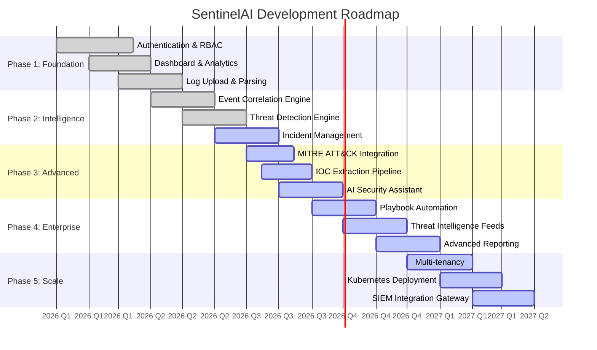

# SentinelAI Roadmap

> **Last Updated:** 2026-07-28  
> **Current Phase:** Core Engine Development

---

## Overview

SentinelAI is under active development. Below is the current status and planned roadmap.

---

## Phase 1: Foundation (Completed)

### Module 1: Authentication & User Management
- [x] JWT-based authentication with access/refresh token rotation
- [x] Role-Based Access Control (Admin, Analyst, Responder, Viewer)
- [x] Multi-Factor Authentication (TOTP)
- [x] Password reset flow with secure tokens
- [x] User profile management
- [x] Session management and force logout

### Module 2: Dashboard & Analytics
- [x] Real-time SOC overview dashboard
- [x] Alert severity distribution charts
- [x] Attack timeline visualization
- [x] MITRE ATT&CK tactic distribution
- [x] Geographic threat mapping
- [x] Top source IP tracking
- [x] WebSocket real-time updates

### Module 3: Log Upload & Parsing
- [x] Multi-format log parser (Syslog, JSON, XML, EVTX, CSV, PCAP)
- [x] ECS-compatible event normalization
- [x] GeoIP enrichment
- [x] Threat score calculation
- [x] Drag-and-drop log upload UI
- [x] Real-time parsing progress

---

## Phase 2: Intelligence (Current)

### Module 4: Event Correlation Engine (Completed)
- [x] Time-based correlation windows
- [x] Sequence-based attack chain detection
- [x] SSH session correlation
- [x] Port scan correlation
- [x] Credential attack correlation
- [x] Firewall block correlation
- [x] Web attack correlation
- [x] Risk scoring for correlated groups

### Module 5: Threat Detection Engine (Completed)
- [x] 19 modular detection rules across 7 categories
- [x] MITRE ATT&CK mapping on all rules
- [x] Risk scoring (0-100 weighted)
- [x] Automated alert generation
- [x] Detection rule registry (JSON templates)
- [x] Modular detection architecture (SSH, Auth, Network, Firewall, Web, Linux, Windows)
- [x] Recommendation generation for each alert
- [x] Alert status lifecycle management

### Module 6: Incident Management (In Progress)
- [ ] Incident creation from alert groups
- [ ] Incident status workflow
- [ ] Analyst assignment
- [ ] Investigation notes
- [ ] Incident timeline
- [ ] Evidence attachment
- [ ] Incident closure report

---

## Phase 3: Advanced (Upcoming)

### Module 7: MITRE ATT&CK Integration
- [ ] Full MITRE ATT&CK v15 matrix integration
- [ ] Automatic technique mapping from detection results
- [ ] MITRE Navigator integration
- [ ] Coverage gap analysis
- [ ] Tactic-to-technique visualization
- [ ] Attack path reconstruction

### Module 8: IOC Extraction Pipeline
- [ ] Automated IOC extraction from logs
- [ ] Indicator types: IP, domain, URL, hash, email
- [ ] IOC enrichment (VirusTotal, AbuseIPDB)
- [ ] IOC lifecycle management
- [ ] IOC sharing (STIX/TAXII)
- [ ] Indicator validation and scoring

### Module 9: AI Security Assistant
- [ ] Gemini-powered log analysis
- [ ] Natural language threat hunting
- [ ] Automated incident summarization
- [ ] Alert enrichment via AI
- [ ] Chat-based security assistant
- [ ] Anomaly detection via ML

---

## Phase 4: Enterprise (Future)

### Module 10: Playbook Automation
- [ ] Visual playbook editor (React Flow)
- [ ] Pre-built playbook templates
- [ ] Conditional branching
- [ ] Automated response actions
- [ ] Integration with external tools
- [ ] Playbook execution logs

### Module 11: Threat Intelligence Feeds
- [ ] STIX/TAXII client
- [ ] Custom threat feed support
- [ ] Automated feed ingestion
- [ ] IOC matching against events
- [ ] Intelligence scoring
- [ ] Feed health monitoring

### Module 12: Advanced Reporting
- [ ] Executive summary reports
- [ ] Compliance reports (SOC 2, PCI DSS, HIPAA)
- [ ] Scheduled report generation
- [ ] Multiple export formats (PDF, CSV, HTML)
- [ ] Custom report templates
- [ ] Report distribution

---

## Phase 5: Scale (Future)

### Module 13: Multi-Tenancy
- [ ] Organization isolation
- [ ] Cross-tenant monitoring (MSSP)
- [ ] Tenant-specific configurations
- [ ] Usage metering and billing
- [ ] Tenant admin portal

### Module 14: Kubernetes Deployment
- [ ] Helm charts
- [ ] Horizontal Pod Autoscaling
- [ ] Service mesh (Istio)
- [ ] Blue/green deployments
- [ ] Chaos engineering tests

### Module 15: SIEM Integration Gateway
- [ ] Splunk HEC integration
- [ ] Elasticsearch output
- [ ] Kafka event streaming
- [ ] Syslog forwarding
- [ ] Cloud SIEM connectors

---

## Technical Debt & Improvements

### Performance
- [ ] Query optimization for large-scale deployments
- [ ] Database partitioning strategy
- [ ] Redis caching for frequent queries
- [ ] CDN for static assets
- [ ] Database connection pooling tuning

### Testing
- [ ] Increase test coverage to >80%
- [ ] Performance/load testing suite
- [ ] Security penetration testing
- [ ] Chaos engineering experiments
- [ ] UI component tests (Storybook)

### Documentation
- [ ] API client SDK (Python, JavaScript)
- [ ] Video tutorials
- [ ] Deployment guides for cloud providers
- [ ] Integration cookbook
- [ ] FAQ and troubleshooting guide

---

## Contribution Opportunities

We welcome contributions in the following areas:

1. **Detection Rules** - New Sigma-compatible rules
2. **Log Parsers** - Additional log format support
3. **Integrations** - Third-party tool connectors
4. **AI Models** - ML-based anomaly detection
5. **Documentation** - Translations, guides, tutorials
6. **Bug Fixes** - See open GitHub issues
7. **Performance** - Query optimization, caching

See [CONTRIBUTING.md](../CONTRIBUTING.md) for guidelines.
