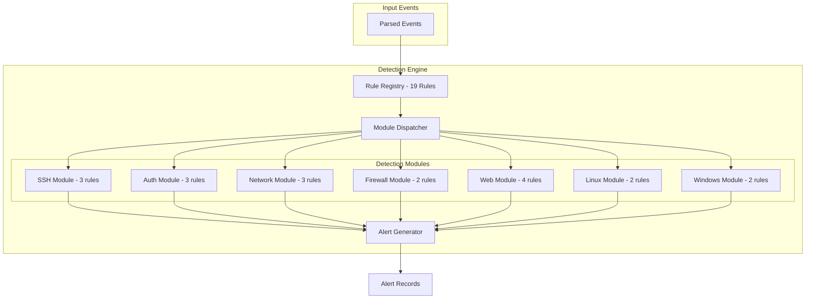

# SentinelAI Detection Rules

> **Version:** 1.0.0  
> **Total Rules:** 19  
> **Categories:** 7  
> **Last Updated:** 2026-07-28

---

## Table of Contents

1. [Overview](#1-overview)
2. [Rule Format](#2-rule-format)
3. [SSH Detection Rules](#3-ssh-detection-rules)
4. [Authentication Detection Rules](#4-authentication-detection-rules)
5. [Network Detection Rules](#5-network-detection-rules)
6. [Firewall Detection Rules](#6-firewall-detection-rules)
7. [Web Detection Rules](#7-web-detection-rules)
8. [Linux Detection Rules](#8-linux-detection-rules)
9. [Windows Detection Rules](#9-windows-detection-rules)
10. [Creating Custom Rules](#10-creating-custom-rules)

---

## 1. Overview

SentinelAI's detection engine uses a modular rule system. Each rule is a self-contained JSON definition that specifies:

- **Triggers** - Conditions that activate the rule
- **Thresholds** - Event count/rate required for alert
- **MITRE Mapping** - ATT&CK technique and tactic
- **Risk Scoring** - Severity and score calculation
- **Recommendations** - Automated remediation guidance



---

## 2. Rule Format

### 2.1 Rule Schema

```json
{
  "id": "CATEGORY-NNN",
  "name": "Human-readable rule name",
  "description": "Detailed explanation of what the rule detects",
  "category": "rule_category",
  "severity": "high",
  "risk_score": 7.5,
  "mitre_mapping": {
    "technique_id": "TXXXX",
    "tactic": "mitre_tactic_name"
  },
  "enabled": true,
  "time_window_minutes": 30,
  "correlation_type": "detection_type",
  "threshold": {
    "min_events": 5,
    "unique_users": 3
  },
  "conditions": {
    "sources": ["source_type"],
    "actions": ["action_type"]
  },
  "recommendation": "Steps to remediate the detected threat"
}
```

### 2.2 Field Descriptions

| Field | Type | Required | Description |
|-------|------|----------|-------------|
| `id` | string | Yes | Unique rule identifier (e.g., `SSH-001`) |
| `name` | string | Yes | Human-readable rule name |
| `description` | string | Yes | Detailed rule description |
| `category` | string | Yes | Module category: `ssh`, `authentication`, `network`, `firewall`, `web`, `linux`, `windows` |
| `severity` | string | Yes | Alert severity: `critical`, `high`, `medium`, `low` |
| `risk_score` | float | Yes | Base risk score (0.0 - 10.0) |
| `mitre_mapping` | object | Yes | MITRE technique ID and tactic |
| `enabled` | boolean | No | Rule active state (default: `true`) |
| `time_window_minutes` | integer | No | Analysis time window |
| `threshold` | object | Yes | Detection thresholds |
| `conditions` | object | Yes | Event matching conditions |
| `recommendation` | string | Yes | Remediation steps |

---

## 3. SSH Detection Rules

### SSH-001: SSH Brute Force Attack

| Property | Value |
|----------|-------|
| **ID** | `SSH-001` |
| **Severity** | High |
| **Risk Score** | 7.5 |
| **MITRE Technique** | T1110 (Brute Force) |
| **MITRE Tactic** | Credential Access |
| **Time Window** | 30 minutes |
| **Threshold** | 5 failed attempts |

**Detection Logic:**
Monitors SSH authentication logs for multiple failed login attempts from the same source IP within 30 minutes. Tracks unique usernames targeted.

**Response Recommendation:**
- Block the source IP at the firewall
- Review SSH logs for successful logins after the brute force
- Implement rate limiting on SSH
- Enforce key-based authentication

---

### SSH-002: Successful Login After Brute Force

| Property | Value |
|----------|-------|
| **ID** | `SSH-002` |
| **Severity** | Critical |
| **Risk Score** | 9.0 |
| **MITRE Technique** | T1078 (Valid Accounts) |
| **MITRE Tactic** | Initial Access |
| **Threshold** | 3+ failures then success |

**Detection Logic:**
Correlates failed authentication attempts followed by a successful login from the same source IP within 30 minutes. Indicates credential compromise.

**Response Recommendation:**
- Immediately rotate the compromised credential
- Check for lateral movement from the affected host
- Review all sessions from the source IP
- Enable MFA on the account

---

### SSH-003: Direct Root Login

| Property | Value |
|----------|-------|
| **ID** | `SSH-003` |
| **Severity** | High |
| **Risk Score** | 8.0 |
| **MITRE Technique** | T1078 (Valid Accounts) |
| **MITRE Tactic** | Privilege Escalation |
| **Detection** | Root user SSH login |

**Detection Logic:**
Detects direct SSH login attempts as the `root` user. Root login over SSH is a security best practice violation.

**Response Recommendation:**
- Disable direct SSH root login
- Ensure all administrative access is via sudo
- Review audit logs for unauthorized privilege escalation

---

## 4. Authentication Detection Rules

### AUTH-001: Password Spray Attack

| Property | Value |
|----------|-------|
| **ID** | `AUTH-001` |
| **Severity** | High |
| **Risk Score** | 7.0 |
| **MITRE Technique** | T1110.003 (Password Spraying) |
| **MITRE Tactic** | Credential Access |
| **Threshold** | 5+ unique usernames |

**Detection Logic:**
Detects a single source IP attempting login across many different usernames, characteristic of password spray attacks where attackers try common passwords against many accounts.

**Response Recommendation:**
- Block the source IP
- Review authentication logs for successful logins
- Implement account lockout policies
- Deploy risk-based authentication

---

### AUTH-002: Credential Stuffing Attack

| Property | Value |
|----------|-------|
| **ID** | `AUTH-002` |
| **Severity** | Critical |
| **Risk Score** | 8.5 |
| **MITRE Technique** | T1110.004 (Credential Stuffing) |
| **MITRE Tactic** | Credential Access |
| **Threshold** | 15+ attempts in 15 min |

**Detection Logic:**
Detects high-volume login attempts from a single source, indicating credential stuffing with previously leaked credentials.

**Response Recommendation:**
- Block the source IP immediately
- Deploy CAPTCHA on login pages
- Implement MFA across all accounts
- Force password reset for targeted accounts

---

### AUTH-003: Impossible Travel Detection

| Property | Value |
|----------|-------|
| **ID** | `AUTH-003` |
| **Severity** | Critical |
| **Risk Score** | 9.5 |
| **MITRE Technique** | T1078 (Valid Accounts) |
| **MITRE Tactic** | Initial Access |
| **Detection** | Geographic anomaly |

**Detection Logic:**
Detects the same user account authenticating from geographically impossible locations within a short time window (e.g., login from New York then Tokyo within 1 hour).

**Response Recommendation:**
- Immediately lock the affected account
- Force password reset
- Check for additional compromised accounts
- Review recent activity from all sessions

---

## 5. Network Detection Rules

### NET-001: Port Scanning Activity

| Property | Value |
|----------|-------|
| **ID** | `NET-001` |
| **Severity** | Medium |
| **Risk Score** | 5.0 |
| **MITRE Technique** | T1046 (Network Service Discovery) |
| **MITRE Tactic** | Discovery |
| **Threshold** | 10+ unique ports in 10 min |

**Detection Logic:**
Detects a source IP connecting to multiple different ports on a target, characteristic of reconnaissance scanning.

**Response Recommendation:**
- Investigate the source IP
- Check for follow-up attack attempts
- Add the IP to threat intelligence feeds
- Harden exposed services

---

### NET-002: Internal Network Reconnaissance

| Property | Value |
|----------|-------|
| **ID** | `NET-002` |
| **Severity** | High |
| **Risk Score** | 7.0 |
| **MITRE Technique** | T1595 (Active Scanning) |
| **MITRE Tactic** | Reconnaissance |
| **Threshold** | 5+ unique destinations |

**Detection Logic:**
Detects an internal IP address scanning multiple different hosts, suggesting lateral movement or internal reconnaissance after initial compromise.

**Response Recommendation:**
- Quarantine the internal host
- Investigate how the host was compromised
- Scan for persistent backdoors
- Review network segmentation

---

### NET-003: Lateral Movement Detection

| Property | Value |
|----------|-------|
| **ID** | `NET-003` |
| **Severity** | Critical |
| **Risk Score** | 9.0 |
| **MITRE Technique** | T1021 (Remote Services) |
| **MITRE Tactic** | Lateral Movement |
| **Threshold** | 3+ unique destinations |

**Detection Logic:**
Detects the same credential or source IP being used to access multiple internal systems, a key indicator of lateral movement.

**Response Recommendation:**
- Isolate the affected accounts and systems
- Conduct forensic analysis on the initial compromise vector
- Review all lateral movement paths
- Implement network micro-segmentation

---

## 6. Firewall Detection Rules

### FW-001: Excessive Firewall Denies

| Property | Value |
|----------|-------|
| **ID** | `FW-001` |
| **Severity** | Medium |
| **Risk Score** | 4.5 |
| **MITRE Technique** | T1595 (Active Scanning) |
| **MITRE Tactic** | Reconnaissance |
| **Threshold** | 20+ denies in 15 min |

**Detection Logic:**
Detects a high number of firewall deny events from a single source IP, indicating either misconfiguration or malicious scanning.

**Response Recommendation:**
- Review firewall rules for misconfigurations
- Check if the source IP is known malicious
- Consider adding the IP to blocklist

---

### FW-002: Blocked Port Scanning

| Property | Value |
|----------|-------|
| **ID** | `FW-002` |
| **Severity** | Medium |
| **Risk Score** | 5.5 |
| **MITRE Technique** | T1046 (Network Service Discovery) |
| **MITRE Tactic** | Discovery |
| **Threshold** | 15+ unique ports |

**Detection Logic:**
Detects firewall blocks of systematic port scanning from an external IP, indicating pre-attack reconnaissance.

**Response Recommendation:**
- Add the source IP to automated blocklist
- Verify no services exposed on unexpected ports
- Review IDS/IPS alerts

---

## 7. Web Detection Rules

### WEB-001: SQL Injection Attempt

| Property | Value |
|----------|-------|
| **ID** | `WEB-001` |
| **Severity** | Critical |
| **Risk Score** | 9.0 |
| **MITRE Technique** | T1190 (Exploit Public-Facing Application) |
| **MITRE Tactic** | Initial Access |

**Detection Patterns:**
`SELECT...FROM`, `UNION SELECT`, `OR 1=1`, `DROP TABLE`, `INSERT INTO`, `DELETE FROM`, `--`, `xp_cmdshell`, `WAITFOR DELAY`, `BENCHMARK()`

**Response Recommendation:**
- Block the source IP at the WAF
- Review targeted endpoint for SQL injection vulnerabilities
- Implement parameterized queries
- Deploy Web Application Firewall rules

---

### WEB-002: Cross-Site Scripting (XSS) Attempt

| Property | Value |
|----------|-------|
| **ID** | `WEB-002` |
| **Severity** | High |
| **Risk Score** | 7.5 |
| **MITRE Technique** | T1059.007 (JavaScript) |
| **MITRE Tactic** | Execution |

**Detection Patterns:**
`<script>`, `javascript:`, `onerror=`, `onload=`, `alert()`, ``, `<svg>`, `<iframe>`

**Response Recommendation:**
- Block the source IP
- Implement Content Security Policy (CSP) headers
- Sanitize user input
- Deploy XSS protection mechanisms

---

### WEB-003: Remote Code Execution Attempt

| Property | Value |
|----------|-------|
| **ID** | `WEB-003` |
| **Severity** | Critical |
| **Risk Score** | 9.5 |
| **MITRE Technique** | T1203 (Exploitation for Client Execution) |
| **MITRE Tactic** | Execution |

**Detection Patterns:**
`; ls`, `; whoami`, `$()`, backtick commands, `system()`, `exec()`, `shell_exec()`, `passthru()`

**Response Recommendation:**
- Block the source IP immediately
- Patch the vulnerable application
- Review server logs for successful exploitation
- Conduct forensic analysis

---

### WEB-004: Path Traversal Attempt

| Property | Value |
|----------|-------|
| **ID** | `WEB-004` |
| **Severity** | High |
| **Risk Score** | 7.0 |
| **MITRE Technique** | T1005 (Data from Local System) |
| **MITRE Tactic** | Collection |

**Detection Patterns:**
`../`, `..\\`, `..%2f`, `..%5c`, `/etc/passwd`, `/windows/win.ini`, `web.config`, `.git/config`

**Response Recommendation:**
- Block the source IP
- Review file permissions
- Implement proper input validation
- Ensure web server runs with least privileges

---

## 8. Linux Detection Rules

### LIN-001: Privilege Escalation via sudo

| Property | Value |
|----------|-------|
| **ID** | `LIN-001` |
| **Severity** | High |
| **Risk Score** | 8.0 |
| **MITRE Technique** | T1068 (Exploitation for Privilege Escalation) |
| **MITRE Tactic** | Privilege Escalation |

**Detection Logic:**
Detects sudo/su usage suggesting privilege escalation from standard user to root.

**Response Recommendation:**
- Review sudoers configuration
- Verify the user's activity is legitimate
- Monitor for additional suspicious commands
- Implement least privilege principles

---

### LIN-002: Suspicious Cron Job Persistence

| Property | Value |
|----------|-------|
| **ID** | `LIN-002` |
| **Severity** | High |
| **Risk Score** | 7.5 |
| **MITRE Technique** | T1053.003 (Cron) |
| **MITRE Tactic** | Persistence |

**Detection Logic:**
Detects modifications to cron jobs, a common technique for establishing persistence on Linux systems.

**Response Recommendation:**
- Review crontab entries for unauthorized jobs
- Check file integrity of system binaries
- Investigate how the attacker gained access

---

## 9. Windows Detection Rules

### WIN-001: Windows Privilege Escalation

| Property | Value |
|----------|-------|
| **ID** | `WIN-001` |
| **Severity** | Critical |
| **Risk Score** | 8.5 |
| **MITRE Technique** | T1543 (Create or Modify System Process) |
| **MITRE Tactic** | Privilege Escalation |

**Detection Logic:**
Detects potential Windows privilege escalation through service installation, registry modification, or scheduled task creation.

**Response Recommendation:**
- Review recently installed services and registry modifications
- Verify the account used
- Conduct memory analysis on the affected host

---

## 10. Creating Custom Rules

### 10.1 Rule Template

```python
# Example: Custom detection module
from app.detection.modules import BaseDetectionModule
from app.schemas.detection import DetectionResult

class CustomDetectionModule(BaseDetectionModule):
    name = "custom"

    async def analyze(self, rule, events, db_session):
        matching = self._find_events(events, rule["conditions"])
        if not matching:
            return None
        
        # Custom detection logic
        if len(matching) >= rule["threshold"]["min_events"]:
            return self._build_result(rule, matching[0],
                title="Custom Alert Title",
                tags=["custom", "detection"],
            )
        return None
```

### 10.2 Registration

```python
# Register your custom rule
from app.detection.registry import DetectionRuleRegistry

CUSTOM_RULE = {
    "id": "CUSTOM-001",
    "name": "Custom Detection Rule",
    "category": "custom",
    "severity": "medium",
    "risk_score": 5.0,
    "mitre_mapping": {
        "technique_id": "T1078",
        "tactic": "initial_access"
    },
    "threshold": {"min_events": 3},
    "conditions": {"sources": ["custom_app"]},
    "recommendation": "Investigate the custom event source.",
}

DetectionRuleRegistry.register(CUSTOM_RULE)
```

### 10.3 Rule Testing

Test rules against sample data using the detection API:

```bash
# Run a specific rule
curl -X POST /api/v1/detection/run \
  -H "Authorization: Bearer <token>" \
  -H "Content-Type: application/json" \
  -d '{"rule_ids": ["CUSTOM-001"]}'

# Run all rules
curl -X POST /api/v1/detection/run-all \
  -H "Authorization: Bearer <token>"
```

### 10.4 Best Practices

1. **Start with clear threshold values** - Tune based on your environment
2. **Map to MITRE ATT&CK** - Enables threat intelligence correlation
3. **Provide actionable recommendations** - Help analysts respond quickly
4. **Set appropriate severity** - Avoid alert fatigue from false positives
5. **Test with real data** - Validate rules against historical incidents
6. **Review and update regularly** - Adapt to evolving threat landscape
