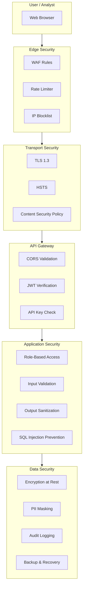
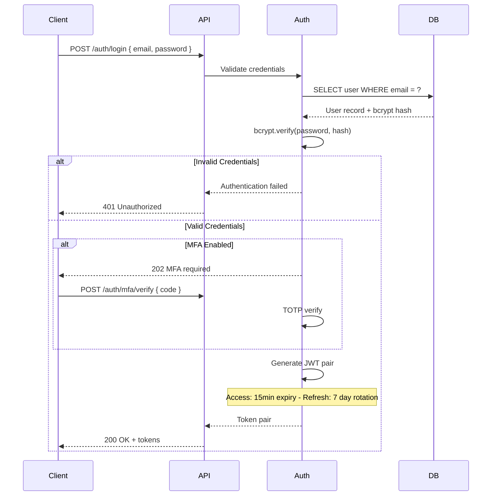
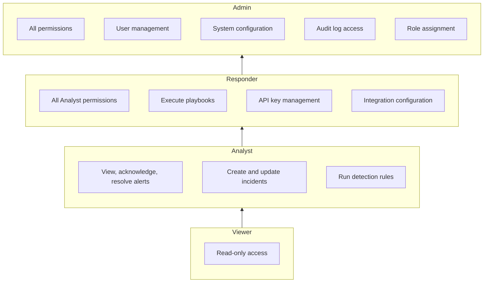
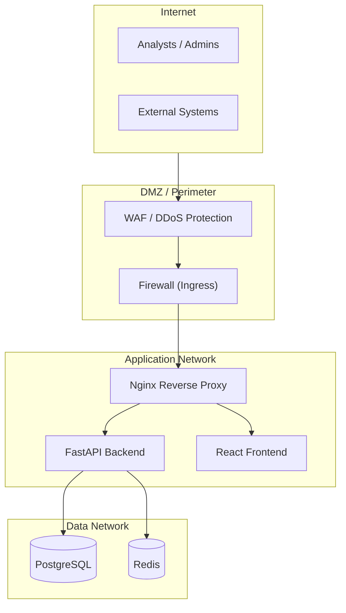
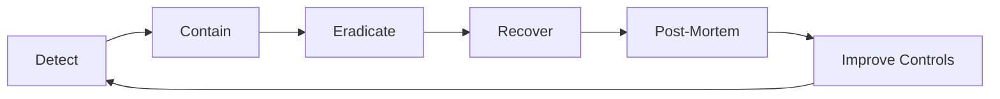

# SentinelAI Security Model

> **Classification:** Internal  
> **Last Updated:** 2026-07-28  
> **Version:** 1.0.0

---

## Table of Contents

1. [Security Overview](#1-security-overview)
2. [Authentication](#2-authentication)
3. [Authorization & RBAC](#3-authorization--rbac)
4. [API Security](#4-api-security)
5. [Data Security](#5-data-security)
6. [Network Security](#6-network-security)
7. [Audit & Compliance](#7-audit--compliance)
8. [Security Checklist](#8-security-checklist)

---

## 1. Security Overview

SentinelAI implements a **defense-in-depth** security architecture across all layers of the stack.



---

## 2. Authentication

### 2.1 JWT Token Architecture



### 2.2 Token Specifications

| Property | Access Token | Refresh Token |
|----------|-------------|---------------|
| **Expiry** | 15 minutes | 7 days |
| **Storage** | Memory / localStorage | httpOnly cookie |
| **Rotation** | None (re-issued via refresh) | Rotation on each use |
| **Revocation** | Not supported (short-lived) | Immediate on logout |
| **Signature** | HS256 with rotation key | HS256 with static key |

### 2.3 Security Controls

- **Token Rotation:** Refresh tokens are rotated on each use to prevent replay attacks
- **Rate Limiting:** Login endpoint limited to 5 attempts/minute per IP
- **Account Lockout:** 5 failed attempts triggers 15-minute lockout
- **Session Management:** Force logout all sessions from account settings
- **MFA Enforcement:** Configurable per role (required for admin)

---

## 3. Authorization & RBAC

### 3.1 Role Hierarchy



### 3.2 Permission Matrix

| Resource | Viewer | Analyst | Responder | Admin |
|----------|--------|---------|-----------|-------|
| View Alerts | Read | Read, Update | Read, Update | Full |
| Manage Incidents | Read | Create, Update | Create, Update | Full |
| Detection Rules | Read | Read | Create, Update | Full |
| Playbooks | Read | Read | Execute | Create, Execute |
| Integrations | - | - | Configure | Full |
| Users | - | - | - | Full |
| Audit Logs | - | - | Read | Full |
| System Config | - | - | Read | Full |
| API Keys | - | - | Manage | Full |

### 3.3 Access Control Implementation

```python
# Example: Role-based decorator
@router.get("/admin/users")
@require_role("admin")
async def list_users(...):
    ...

# Example: Permission-based check
@router.patch("/alerts/{alert_id}")
async def update_alert(
    alert_id: str,
    current_user: User = Depends(get_current_user),
):
    if current_user.role not in ["analyst", "responder", "admin"]:
        raise HTTPException(status_code=403)
    ...
```

---

## 4. API Security

### 4.1 Rate Limiting

| Endpoint Group | Limit | Window | Burst |
|---------------|-------|--------|-------|
| Authentication | 5 requests | 1 minute | 10 |
| Alert Queries | 100 requests | 1 minute | 200 |
| Detection Run | 10 requests | 1 minute | 20 |
| Dashboard | 60 requests | 1 minute | 100 |
| Webhook Ingestion | 500 requests | 1 minute | 1000 |
| Admin | 30 requests | 1 minute | 50 |

### 4.2 Request Validation

- **Input:** All request bodies validated via Pydantic schemas
- **SQL Injection:** Parameterized queries via SQLAlchemy ORM
- **XSS:** Output encoding in frontend (React JSX)
- **CSRF:** Token-based protection for state-changing operations
- **File Upload:** Size limits (10MB max), type validation, virus scanning

### 4.3 Security Headers

```nginx
# Nginx configuration
add_header X-Content-Type-Options "nosniff" always;
add_header X-Frame-Options "DENY" always;
add_header X-XSS-Protection "1; mode=block" always;
add_header Strict-Transport-Security "max-age=31536000; includeSubDomains" always;
add_header Content-Security-Policy "default-src 'self'; script-src 'self' 'unsafe-inline'; style-src 'self' 'unsafe-inline'; img-src 'self' data:; font-src 'self' data:; connect-src 'self' ws: wss:" always;
add_header Referrer-Policy "strict-origin-when-cross-origin" always;
add_header Permissions-Policy "camera=(), microphone=(), geolocation=()" always;
```

---

## 5. Data Security

### 5.1 Encryption at Rest

| Data Type | Encryption Method | Key Management |
|-----------|------------------|----------------|
| User passwords | bcrypt (12 rounds) | N/A (one-way hash) |
| MFA secrets | AES-256-GCM | Application key |
| API keys | bcrypt (8 rounds) | N/A (one-way hash) |
| Alert data | PostgreSQL TDE | Database-level |
| Log storage | Filesystem encryption | OS-level |
| Backups | GPG symmetric encryption | Backup key |

### 5.2 Data Classification

```mermaid
flowchart LR
    subgraph Public["Public"]
        P1["Application name"]
        P2["Version number"]
        P3["Documentation"]
    end
    
    subgraph Internal["Internal"]
        I1["Alert metadata"]
        I2["Incident categories"]
        I3["Asset inventory"]
    end
    
    subgraph Confidential["Confidential"]
        C1["Alert details/raw data"]
        C2["User email addresses"]
        C3["IP addresses"]
        C4["Authentication logs"]
    end
    
    subgraph Restricted["Restricted"]
        R1["Password hashes"]
        R2["MFA secrets"]
        R3["API keys"]
        R4["Encryption keys"]
        R5["Audit logs"]
    end
    
    Public --> Internal
    Internal --> Confidential
    Confidential --> Restricted
```



### 5.3 Data Retention

| Data Type | Retention | Deletion Policy |
|-----------|-----------|-----------------|
| Alerts | 365 days | Soft-delete, then purge |
| Raw Logs | 90 days | Auto-purge via scheduled job |
| Parsed Events | 180 days | Auto-purge via scheduled job |
| Incidents | 730 days | Archive before deletion |
| Audit Logs | 1095 days | Immutable, append-only |
| User Sessions | Token expiry | Automatic on expiry |
| Failed Logins | 90 days | Auto-purge |

---

## 6. Network Security

### 6.1 Architecture



### 6.2 Firewall Rules

| Source | Destination | Port | Protocol | Purpose |
|--------|-------------|------|----------|---------|
| Internet | Nginx | 80, 443 | TCP | HTTP/HTTPS |
| Nginx | Backend | 8000 | TCP | API proxy |
| Nginx | Frontend | 3000 | TCP | SPA proxy |
| Backend | PostgreSQL | 5432 | TCP | Database |
| Backend | Redis | 6379 | TCP | Cache |
| Backend | Internet | 443 | TCP | AI API calls |

---

## 7. Audit & Compliance

### 7.1 Audit Log Events

```json
{
  "id": "uuid",
  "user_id": "user-uuid",
  "action": "alert.acknowledge",
  "resource": "alert",
  "resource_id": "alert-uuid",
  "details": {
    "previous_status": "open",
    "new_status": "acknowledged"
  },
  "ip_address": "10.0.0.1",
  "user_agent": "Mozilla/5.0...",
  "created_at": "2026-07-28T10:30:00Z"
}
```

### 7.2 Audited Events

| Category | Events |
|----------|--------|
| **Authentication** | Login success/failure, logout, token refresh, MFA setup |
| **Alert Management** | Create, acknowledge, resolve, delete, false positive |
| **Incident Management** | Create, update status, assign, add notes, close |
| **User Management** | Create, update role, disable, enable, password reset |
| **Configuration** | Detection rules, integrations, playbooks, report schedules |
| **System** | Service start/stop, migrations, backup/restore |

### 7.3 Compliance Standards

SentinelAI is designed to support compliance with:

- **SOC 2** - Audit logging, access controls, change management
- **ISO 27001** - Information security management
- **GDPR** - Data retention, PII handling, right to deletion
- **HIPAA** - Access controls, audit trails, encryption
- **PCI DSS** - Access control, monitoring, testing

---

## 8. Security Checklist

### 8.1 Pre-Deployment

- [ ] `SECRET_KEY` is generated with `openssl rand -hex 32`
- [ ] TLS certificate installed and auto-renewing
- [ ] Database passwords rotated from defaults
- [ ] Rate limiting configured for all endpoints
- [ ] CORS origins restricted to known domains
- [ ] Audit logging enabled
- [ ] Backup strategy implemented and tested
- [ ] Monitoring and alerting configured

### 8.2 Ongoing Operations

- [ ] Weekly vulnerability scanning
- [ ] Monthly dependency updates
- [ ] Quarterly penetration testing
- [ ] Access review every 90 days
- [ ] Backup restoration test monthly
- [ ] Log review for suspicious activity
- [ ] Incident response drill quarterly

### 8.3 Incident Response



---

## 9. Reporting Vulnerabilities

If you discover a security vulnerability in SentinelAI:

1. **Do not** open a public GitHub issue
2. Email details to: security@sentinelai.dev
3. Include steps to reproduce and impact assessment
4. Allow 72 hours for initial response

We practice responsible disclosure and will credit researchers in our security acknowledgments.
