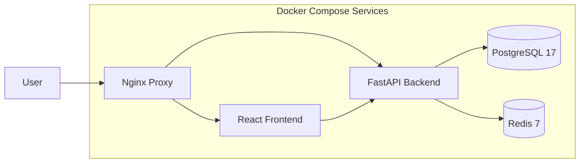
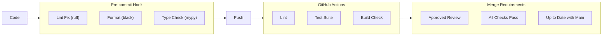

# SentinelAI Setup Guide

> **Last Updated:** 2026-07-28  
> **Supported OS:** Linux (recommended), macOS, Windows (WSL2)

---

## Table of Contents

1. [Prerequisites](#1-prerequisites)
2. [Quick Start (Docker)](#2-quick-start-docker)
3. [Manual Setup](#3-manual-setup)
4. [Configuration](#4-configuration)
5. [Development](#5-development)
6. [Production Deployment](#6-production-deployment)
7. [Troubleshooting](#7-troubleshooting)

---

## 1. Prerequisites

| Requirement | Version | Purpose |
|-------------|---------|---------|
| Docker & Compose | 24+ | Containerized deployment (recommended) |
| Python | 3.12+ | Backend runtime |
| Node.js | 22+ | Frontend runtime |
| PostgreSQL | 17+ | Primary database |
| Redis | 7+ | Cache & message broker |
| Make | 4+ | Automation (optional) |

---

## 2. Quick Start (Docker)

The fastest way to get SentinelAI running:

```bash
# Clone the repository
git clone https://github.com/Shravani-kurkute/SOC-Analayzer.git
cd SOC-Analayzer

# Copy environment configuration
cp sentinelai-backend/.env.example sentinelai-backend/.env
cp sentinelai-frontend/.env.example sentinelai-frontend/.env

# Start all services
docker compose up -d

# Run database migrations
docker compose exec backend alembic upgrade head

# Create initial admin user
docker compose exec backend python scripts/seed.py

# Access the platform
# Frontend: http://localhost:3000
# API Docs:  http://localhost:8000/api/v1/docs
```



### Docker Compose Services

| Service | Image | Port | Purpose |
|---------|-------|------|---------|
| `postgres` | postgres:17-alpine | 5432 | Primary database |
| `redis` | redis:7-alpine | 6379 | Cache & pub/sub |
| `backend` | custom | 8000 | FastAPI application |
| `frontend` | custom | 3000 | React SPA |
| `nginx` | nginx:alpine | 80/443 | Reverse proxy |

---

## 3. Manual Setup

### 3.1 Backend Setup

```bash
cd sentinelai-backend

# Create virtual environment
python -m venv venv
source venv/bin/activate  # Linux/Mac
# venv\Scripts\activate   # Windows

# Install dependencies
pip install -r requirements.txt

# Configure environment
cp .env.example .env
# Edit .env with your settings

# Run migrations
alembic upgrade head

# Start development server
uvicorn app.main:app --reload --host 0.0.0.0 --port 8000
```

### 3.2 Frontend Setup

```bash
cd sentinelai-frontend

# Install dependencies
npm install

# Configure environment
cp .env.example .env

# Start development server
npm run dev
# Opens at http://localhost:3000
```

### 3.3 Database Setup

```bash
# Create database
createdb sentinelai

# Or via psql
psql -U postgres -c "CREATE DATABASE sentinelai;"

# Run migrations
cd sentinelai-backend
alembic upgrade head

# Verify migration
alembic current
```

---

## 4. Configuration

### 4.1 Backend Environment Variables

| Variable | Required | Default | Description |
|----------|----------|---------|-------------|
| `SECRET_KEY` | Yes | - | JWT signing key (min 32 chars) |
| `POSTGRES_SERVER` | Yes | `localhost` | PostgreSQL host |
| `POSTGRES_PORT` | No | `5432` | PostgreSQL port |
| `POSTGRES_USER` | Yes | `sentinelai` | Database user |
| `POSTGRES_PASSWORD` | Yes | - | Database password |
| `POSTGRES_DB` | Yes | `sentinelai` | Database name |
| `REDIS_HOST` | Yes | `localhost` | Redis host |
| `REDIS_PORT` | No | `6379` | Redis port |
| `GEMINI_API_KEY` | No | - | Google Gemini AI key |
| `CORS_ORIGINS` | No | `["http://localhost:3000"]` | Allowed origins |
| `ENVIRONMENT` | No | `development` | `development`, `staging`, `production` |

### 4.2 Frontend Environment Variables

| Variable | Required | Default | Description |
|----------|----------|---------|-------------|
| `VITE_API_BASE_URL` | Yes | `http://localhost:8000` | Backend API URL |
| `VITE_API_PREFIX` | No | `/api/v1` | API version prefix |
| `VITE_WS_URL` | No | - | WebSocket URL |
| `VITE_API_TIMEOUT` | No | `30000` | Request timeout (ms) |

### 4.3 Environment File Template

**`sentinelai-backend/.env`:**

```bash
# Security
SECRET_KEY=your-secret-key-at-least-32-characters-long
ENCRYPTION_KEY=your-encryption-key-for-sensitive-data

# Database
POSTGRES_SERVER=localhost
POSTGRES_PORT=5432
POSTGRES_USER=sentinelai
POSTGRES_PASSWORD=changeme
POSTGRES_DB=sentinelai

# Redis
REDIS_HOST=localhost
REDIS_PORT=6379

# AI (Optional)
GEMINI_API_KEY=your-gemini-api-key

# Application
ENVIRONMENT=development
DEBUG=true
CORS_ORIGINS=["http://localhost:3000"]

# Rate Limiting
RATE_LIMIT_ENABLED=true
RATE_LIMIT_DEFAULT=100/minute
```

---

## 5. Development

### 5.1 Available Commands

**Frontend:**

| Command | Purpose |
|---------|---------|
| `npm run dev` | Start Vite dev server with HMR |
| `npm run build` | Production build |
| `npm run lint` | ESLint check |
| `npm run lint:fix` | Auto-fix lint issues |
| `npm run format` | Prettier formatting |
| `npm run typecheck` | TypeScript type checking |
| `npm test` | Run Vitest tests |
| `npm run test:coverage` | Test with coverage report |

**Backend:**

| Command | Purpose |
|---------|---------|
| `uvicorn app.main:app --reload` | Start dev server |
| `alembic upgrade head` | Run migrations |
| `alembic revision --autogenerate -m "msg"` | Create migration |
| `pytest` | Run test suite |
| `pytest --cov=app` | Test with coverage |
| `ruff .` | Lint Python files |
| `black .` | Format Python files |
| `mypy .` | Type checking |

### 5.2 Git Workflow

```bash
# Create feature branch
git checkout -b feature/your-feature

# Make changes and commit
git add .
git commit -m "feat(module): description"

# Keep branch updated
git fetch origin
git rebase origin/main

# Push and create PR
git push origin feature/your-feature
```

### 5.3 Code Quality



---

## 6. Production Deployment

### 6.1 Docker Production

```bash
# Build with production configuration
docker compose -f docker-compose.yml -f docker-compose.prod.yml build

# Start services
docker compose -f docker-compose.yml -f docker-compose.prod.yml up -d

# Initialize database
docker compose exec backend alembic upgrade head

# Create admin user
docker compose exec backend python scripts/seed.py --admin
```

### 6.2 Production Checklist

- [ ] Generate strong `SECRET_KEY` (256-bit random)
- [ ] Enable HTTPS with valid TLS certificate
- [ ] Configure rate limiting for all endpoints
- [ ] Set up database backups (WAL archiving)
- [ ] Configure monitoring & alerting (Prometheus)
- [ ] Enable audit logging
- [ ] Set up log rotation
- [ ] Configure firewall rules
- [ ] Set up fail2ban for brute force protection
- [ ] Regular security updates (Docker images)

### 6.3 Resource Requirements

| Environment | CPU | RAM | Storage | Services |
|-------------|-----|-----|---------|----------|
| Development | 2 cores | 4 GB | 20 GB | backend + frontend |
| Staging | 4 cores | 8 GB | 50 GB | all services |
| Production (Small) | 4 cores | 16 GB | 200 GB | all services + replica |
| Production (Medium) | 8 cores | 32 GB | 1 TB | all services + replicas |

---

## 7. Troubleshooting

### 7.1 Common Issues

**Database connection refused:**
```bash
# Check if PostgreSQL is running
systemctl status postgresql
# Or with Docker
docker compose ps postgres

# Verify credentials in .env
# Test connection
psql -h localhost -U sentinelai -d sentinelai
```

**Frontend cannot reach backend:**
```bash
# Check VITE_API_BASE_URL in .env
# Should point to backend: http://localhost:8000

# Verify backend is running
curl http://localhost:8000/health

# Check CORS configuration
# CORS_ORIGINS should include the frontend URL
```

**Migration errors:**
```bash
# Check current migration version
alembic current

# View migration history
alembic history

# Rollback if needed
alembic downgrade -1

# Re-run migrations
alembic upgrade head
```

### 7.2 Logs & Diagnostics

```bash
# Backend logs
docker compose logs -f backend

# Database logs
docker compose logs -f postgres

# Nginx access logs
docker compose logs -f nginx

# Check Redis connectivity
docker compose exec redis redis-cli ping
# Should respond: PONG

# Run health check
curl http://localhost:8000/health
# Expected: {"status": "healthy", "version": "1.0.0", "environment": "development"}
```

### 7.3 Getting Help

- **GitHub Issues:** Report bugs at [github.com/Shravani-kurkute/SOC-Analayzer/issues](https://github.com/Shravani-kurkute/SOC-Analayzer/issues)
- **Documentation:** See other docs in this `docs/` directory
- **Architecture:** [ARCHITECTURE.md](./ARCHITECTURE.md)
- **API Reference:** [API.md](./API.md)
- **Security:** [SECURITY.md](./SECURITY.md)
